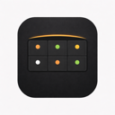
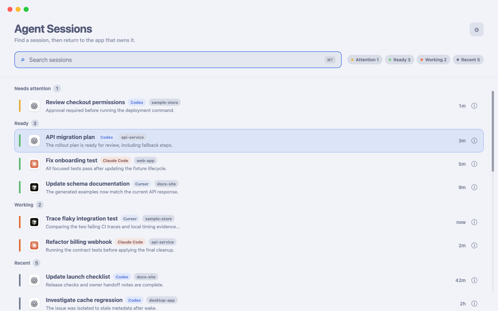

<div align="center">
  
  <h1>Agent Visor</h1>
  <p><strong>See every coding-agent session. Return to the right one instantly.</strong></p>
  <p>
    Agent Visor is a macOS menu-bar status and navigation layer for Codex,
    Claude Code, Cursor, and terminal-hosted agents.
  </p>
  <p>
    <a href="https://github.com/824zzy/agent-visor/releases/latest"></a>
  </p>
  <p>
    <a href="#requirements"></a>
    <a href="#license"></a>
    <a href="https://github.com/824zzy/agent-visor/stargazers"></a>
  </p>
</div>

<div align="center">
  
  <br><br>
  
  <br><small>Screenshots use synthetic session names, projects, and activity.</small>
</div>

## Why Agent Visor?

Coding agents already have excellent native conversation interfaces. The hard part is keeping track of several sessions across Codex Desktop, terminals, Cursor, and other hosts.

Agent Visor answers three questions without becoming another chat client:

- **What needs me?** Needs attention and unseen Ready sessions lead, followed by Working, seen Ready, and Recent work.
- **Where was I?** Recent work stays searchable even when it no longer fits in the menu bar.
- **How do I get back?** A click or keyboard shortcut returns to the owning app or terminal.

The owning app remains the authoritative conversation and control surface. Agent Visor can show status evidence, latest activity, and mirrored transcript details, but it does not claim to replace Codex, Claude Code, Cursor, or a terminal.

## Main surfaces

### Menu-bar pills

The menu bar is the ambient status strip. Each pill shows a session title and state. Active sessions take priority, recent sessions fill available space, and `+N` opens the sessions that do not fit.

- Click to return to the original owner.
- Opening a Ready session acknowledges that completion and moves its pill behind Working without changing its Ready status.
- Option-click to inspect the session in Agent Visor.
- Hover for full title, source, model, reasoning effort, execution policy, context usage, path, and freshness when the source provides them.
- Hold the configured shortcut modifiers to reveal 1-9, then press a number to jump directly.

### Agent Sessions browser

The browser is the complete searchable workspace. It groups sessions by state, preserves source and project context, supports arrow-key navigation, and opens the selected session in its owning app. The info action opens a compact inspector instead of a replacement chat.

### Codex usage glance

When Codex exposes a recognized limit, an optional fixed menu-bar pill shows `5h NN% | 7d NN%`. It stays hidden for unsupported accounts and uses authenticated app-server data rather than scraping the ChatGPT UI.

## Supported sources

| Source | Discovery and status | Primary navigation |
| --- | --- | --- |
| Codex Desktop | Recent threads, rollout activity, approvals, and questions when available | Focus Codex; exact task selection is best effort |
| Codex CLI | Process, TTY, and rollout evidence | Focus the owning terminal pane |
| Claude Code CLI | Hook and transcript evidence | Focus Ghostty, iTerm2, Cursor, Zed, or another detected host |
| Claude Code Desktop | Transcript-backed sessions | Focus Claude Desktop |
| Cursor and Zed | Transcript-backed hosted sessions | Focus the owning editor |
| Auggie | Hook-backed sessions when installed | Focus the detected host |

Agent Visor deliberately rejects metadata-only rows when there is no transcript or actionable state. A running host process alone is not treated as a real session.

## Session semantics

1. **Needs attention**: an approval or structured question is blocking the turn.
2. **Ready**: the turn finished or the agent is waiting for normal input.
3. **Working**: the agent is processing or compacting.
4. **Recent**: no turn is active, but the session remains useful for navigation.

Status can be hook-driven or inferred from source transcripts. The inspector labels freshness and evidence so a disk-derived state is not presented as stronger than it is.

## Installation

### Homebrew (recommended)

```bash
brew tap 824zzy/agent-visor
brew install --cask 824zzy/agent-visor/agent-visor
```

Version 2.4.7 is a one-time updater bridge. Homebrew removes quarantine and
re-signs this transitional ad-hoc release during installation. Version 2.4.8
adopts the long-lived release identity that later updates preserve.

### Direct download

Download the latest ZIP from [GitHub Releases](https://github.com/824zzy/agent-visor/releases/latest), move `Agent Visor.app` to `/Applications`, then open it. Because the project does not use a paid Apple Developer ID, macOS may block a direct download on first launch. Use **System Settings > Privacy & Security > Open Anyway**, or run:

```bash
xattr -dr com.apple.quarantine "/Applications/Agent Visor.app"
```

## Setup

1. Launch Agent Visor.
2. Grant **Accessibility** when prompted. It is used for menu-bar geometry and supported app or terminal navigation.
3. On macOS 15 or later, add Agent Visor under **System Settings > Privacy & Security > Full Disk Access**. This lets the app read transcripts under `~/.claude`, `~/.codex`, and `~/.cursor`.
4. Start or open a supported agent session. Agent Visor discovers it automatically when the source provides sufficient evidence.

Without Full Disk Access on macOS 15, transcript reads can fail silently and the session list may be empty.

## Requirements

- Apple Silicon Mac
- macOS 14 Sonoma or later
- Accessibility permission
- Full Disk Access on macOS 15 or later for transcript-backed discovery

## Privacy

Conversation data and file paths stay on the Mac. Agent Visor reads local agent transcripts and communicates with supported local app or terminal interfaces.

The app sends limited product analytics through Mixpanel: launches, app/build/macOS versions, detected Claude Code version, and session-start events. It does not send conversation text or file paths.

## Development

Core behavior lives in the pure Swift package under `AgentVisorCore`; app UI and integrations live under `AgentVisor`.

```bash
swift test --package-path AgentVisorCore
scripts/dev-build.sh
```

The debug build product is written to:

```text
/tmp/av-debug-build/Build/Products/Debug/Agent Visor Dev.app
```

Do not launch or authorize that transient copy. The script deploys and launches
the stable development app at:

```text
/Applications/Agent Visor Dev.app
```

Debug uses the distinct name, icon, and bundle identifier `com.824zzy.AgentVisor.Dev`.
macOS therefore shows `Agent Visor Dev` separately from the installed
`Agent Visor` in Accessibility and Full Disk Access. Grant permissions to the
variant that is actually running. Set `AV_DEV_INSTALL_DIR` only when the
development app cannot be installed in `/Applications`.

For a distributable Release build, use the dedicated script and derived-data path:

```bash
scripts/build.sh
```

Do not clean-build Release in Xcode's default DerivedData when preserving local TCC grants matters.

## Credits

Agent Visor started as a fork of [Claude Island](https://github.com/farouqaldori/claude-island) by [@farouqaldori](https://github.com/farouqaldori).

## License

[Apache 2.0](LICENSE.md)
