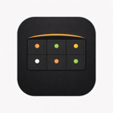
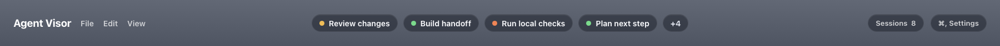
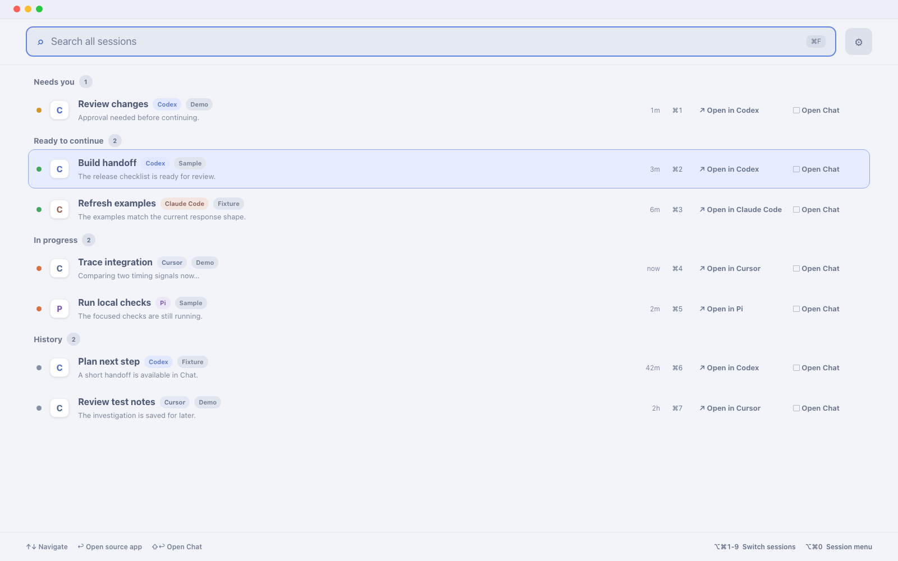
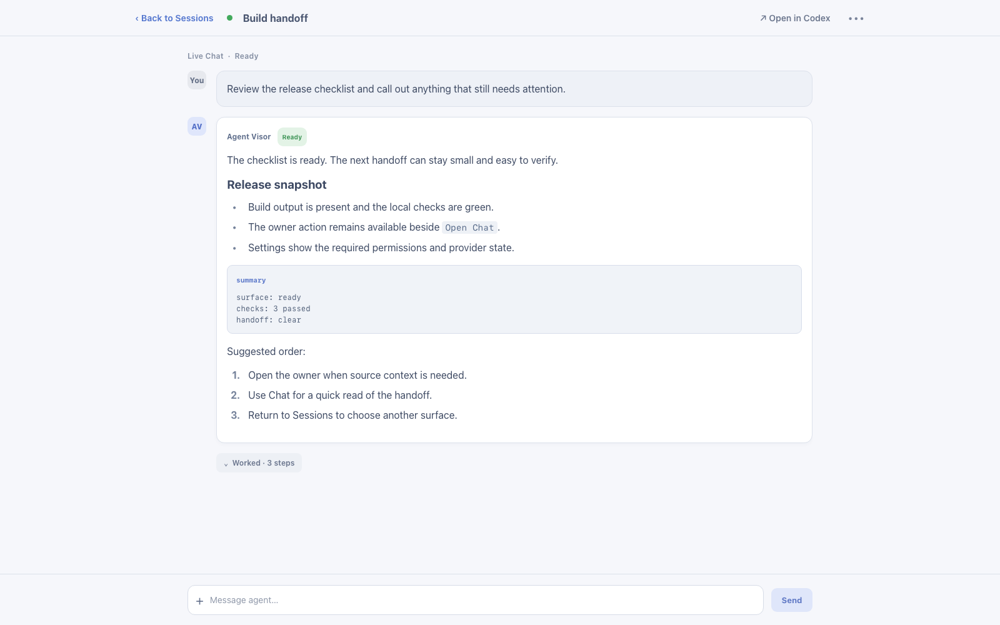
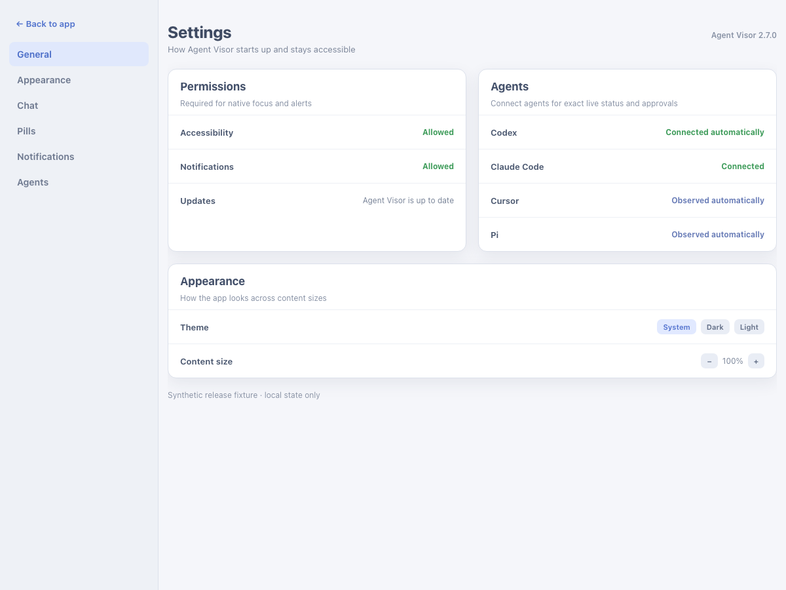

  
  <h1>Agent Visor</h1>
  
<strong>See every coding-agent session. Return to the right one instantly.</strong>

  

    Agent Visor is an Electron macOS menu-bar workspace for Codex, Claude Code,
    Pi, Cursor, Zed, Auggie, and terminal-hosted agents.
  

  

    
  

  

    
    
    
  

  
    
  
    
  
    
  
   <small>Screenshots use synthetic session names, projects, conversation content, and settings. They illustrate the menu-bar, Sessions, Chat, and Settings surfaces.</small>

## Why Agent Visor?

Coding agents already have native conversation interfaces. Agent Visor is a
status and navigation layer for keeping track of several sessions across
Codex, terminals, editors, and other hosts.

Agent Visor answers three questions from one menu-bar workspace:

- **What needs me?** Needs attention and Working pills lead, followed by completed sessions ordered by recent activity, then History shortcuts.
- **Where was I?** Recent work stays searchable even when it no longer fits in the menu bar.
- **How do I continue?** Return to the owning application or terminal, or open the supported Agent Visor Chat view.

The owning app remains the authoritative conversation and control surface.
Agent Visor discovers local evidence and routes actions only when the provider
and destination are known.

## Main surfaces

### Menu-bar pills

The menu bar is the ambient status strip. Each pill shows a session title and
state. Active sessions take priority, recent sessions fill available space, and
<code>+N</code> opens sessions that do not fit.

- Click to return to the original owner.
- Opening a Ready session acknowledges that completion and stops its pulse without changing its rank or Ready status.
- Option-click to enter the session's Chat in Agent Visor.
- Hover for full title, source, model, reasoning effort, execution policy, context usage, path, and freshness when the source provides them.
- Hold the configured shortcut modifiers to reveal numbered sessions, then press a number to jump directly.

### Agent Sessions browser

The browser is the complete searchable workspace. Open it from the menu-bar
item, the Dock, or the global window hotkey. It groups sessions by state,
preserves source and project context, and supports arrow-key navigation.

Row click and Return use the canonical owner when available and name that
destination as **Open in <code>&lt;owner&gt;</code>**. Shift-Return and the explicit
**Open Chat** action enter Agent Visor Chat when supported. Chat-only history rows open
Chat as their primary action. **Back to Sessions** preserves the search query,
keyboard cursor, and viewport.

### Agent Visor Chat

Chat displays supported provider history, grouped work, reasoning, tools,
images, questions, approvals, pagination, and technical Details in the same
window as Sessions.

The owner remains authoritative. Chat can read an open conversation without
opening a native writer, even after the conversation becomes old or its
completion is acknowledged in the Sessions list. A Send attempts the exact
provider route only at the delivery boundary. Unsupported control routes,
Zed-hosted sessions, and other owner-only rows show an explicit reason and
owner action. Sending and approval actions appear only when the current
provider capability and exact session identity allow them.

Active Codex sessions expose provider-backed composer controls for model,
reasoning effort, and access profile. The compact model and effort control shows
the catalog values supported by the current session; the access menu keeps
existing approval settings unchanged. A selection applies from your next
message until changed, and an unavailable provider option remains unavailable
rather than being inferred locally.

### Settings and native services

Settings controls Launch at Login, application and Sessions shortcuts, theme,
content size, pill display, full-screen visibility, Codex usage, Chat
visibility, notification sound, and agent connections.

The Electron shell owns the window and daemon lifecycle. A small signed Swift
helper owns macOS-only work such as Accessibility checks, menu-bar panels,
global shortcuts, display topology, notifications, Dock badges, and exact
owner focus. Closing the window hides it; Quit stops only processes started by
Agent Visor and leaves provider applications running.

### Codex usage glance

When Codex exposes a recognized limit, an optional menu-bar pill shows
<code>5h NN% | 7d NN%</code>. Unsupported or unavailable usage remains hidden. Claude
usage is currently unavailable because the Electron daemon has no
provider-authoritative credential route.

## Alfred session search

With Alfred Powerpack, the optional [Agent Visor Sessions workflow](integrations/alfred/README.md)
lets you type `av <query>` to find sessions by title, project, agent, or folder.
Return opens the original app or terminal through Agent Visor's existing navigation.
The companion app must be running with Alfred support enabled in its build.

## Supported sources

| Source | Discovery and status | Owner action | Chat capability |
| --- | --- | --- | --- |
| Claude Code | Local hooks, process metadata, and transcripts | Focus the detected terminal, Cursor, Zed, or Claude owner | Text, images, questions, and approvals when a verified route exists; history can be read-only |
| Codex CLI | Rollouts, SQLite, process, TTY, and hook evidence | Focus the owning terminal | Provider-routed text and local images when the exact route is available; inactive or unsupported terminal routes explain their owner-only status |
| Codex Desktop | Thread database plus exact opened-thread resolution; no supported Desktop-local writer endpoint is currently available | Open the verified <code>codex://threads/&lt;id&gt;</code> owner route | Chat is read-only until Send proves a route can be acquired. An owner-held thread rejects the send safely and preserves the draft; a locally owned route is released after the confirmed turn or Stop while Chat stays open |
| Pi CLI | Process and tree-shaped transcript evidence plus an automatic local lifecycle integration | Focus the exact owning terminal | Text and ordered local-image paths when the verified terminal route is available; owner-only states remain explicit |
| Cursor | Cursor-owned transcripts and terminal evidence | Focus the owning editor or terminal | Read-only history |
| Zed-hosted agents | Zed database identity, title, workspace, and provider transcript | Focus Zed; exact thread reveal is best effort | Read-only history |
| Auggie | Authenticated hook lifecycle | Focus the detected owner | Observe-only history |

Agent Visor rejects metadata-only rows when there is no transcript or actionable
state. A running host process alone is not treated as a real session.

## Session semantics

Agent Visor keeps four independent facts for an opened conversation:

1. **Conversation**: the provider says whether the conversation is open,
   archived, or currently unknown.
2. **Turn**: the current or most recently observed turn is working, needs an
   answer, ready for input, or unknown.
3. **Route**: the exact provider route is available, waiting for a running
   turn, or unavailable.
4. **Attention**: completion acknowledgment controls attention indicators;
   phase and activity recency determine list order.

The Sessions list uses attention and recency. They do not end a conversation
and they do not decide whether Chat can send or stop. A quiet or acknowledged
conversation remains the same conversation when it is opened again.

When an open route is ready, the composer continues the existing conversation
regardless of list age. While another turn is running and steering or queueing
is not verified, Agent Visor keeps the draft and asks the user to send it after
the turn finishes. A temporary provider or helper outage keeps the composer
draft in place and offers retry; the owner action remains available. Archived,
unsupported, automation, and owner-only states show an explicit reason and an
action to continue in the source application.

For Codex Desktop, a ready thread record alone does not prove a local write
route. Chat opening and read-time refreshes never acquire the native writer.
Agent Visor presents the conversation as available for a tentative Send while
keeping ownership unverified. Send is the admission boundary: it acquires the
exact route, reports an owner-only rejection without losing the draft, and
marks the route owned only after the provider accepts the turn.

After Codex confirms turn completion or Stop, Agent Visor releases its local
writer automatically while Chat stays open. If the provider connection ends
before completion is confirmed, the route stays unavailable until the user
retries after the provider state is clear. Retry restores tentative readiness
only when a fresh ready lifecycle record carries the same turn identity;
otherwise the draft stays staged with the owner action available.

When Codex still owns an idle thread in another process, the daemon reports an
owner-only route after the attempted send instead of claiming that the thread
is owned locally. Agent Visor keeps the local draft and staged settings visible
while the user continues in Codex; it does not resume a competing writer
automatically.

Stop is shown only when the daemon advertises the exact delivery/turn identity
that it can cancel. State and capability revisions refresh Chat independently
of transcript content, and older history pages cannot overwrite a newer
capability projection.

For local diagnostics, set `AGENT_VISOR_DATA_DIR`. The server writes bounded,
redacted route records to `codex-route-diagnostics.jsonl` and keeps at most one
rotated `.1` backup. Prompt text, images, credentials, and tool output are not
written.

## Installation

### Homebrew (recommended)

~~~bash
brew tap 824zzy/agent-visor
brew install --cask 824zzy/agent-visor/agent-visor
~~~

Homebrew removes quarantine while preserving Agent Visor's long-lived release
identity.

### Direct download

Download the latest ZIP from [GitHub Releases](https://github.com/824zzy/agent-visor/releases/latest), move <code>Agent Visor.app</code> to <code>/Applications</code>, then open it. The public build uses a self-signed release identity, so macOS may block a direct download on first launch. Use **System Settings > Privacy & Security > Open Anyway**, or run:

~~~bash
xattr -dr com.apple.quarantine "/Applications/Agent Visor.app"
~~~

## Upgrade and rollback

Agent Visor 2.7.0 is the first stable Electron release. Install it through
Homebrew or GitHub Releases, launch the copy in <code>/Applications</code>, and keep the
v2.6.1 Swift release available during the first launch.

On first start, Agent Visor imports the staging Electron profile, when it is
present and not live, into the production private settings file at:

~~~text
~/Library/Application Support/Agent Visor/settings.json
~~~

The staging source is `~/Library/Application Support/Agent Visor Next`. If that
source is live, import waits until the older Agent Visor exits, leaves the
source untouched, and retries on a later launch. The copied profile excludes
transient Electron lock markers. Provider transcripts, databases, hooks, and
live session records are outside this profile migration and are always read in
place; Agent Visor does not copy or rewrite them as part of the cutover.

To roll back, quit Agent Visor, install the exact [Agent Visor v2.6.1
ZIP](https://github.com/824zzy/agent-visor/releases/download/v2.6.1/AgentVisor-v2.6.1.zip), and launch the Swift application from <code>/Applications</code>. The v2.6.1 release is build 53 and uses the same public application identity. Keep the production Electron profile (`~/Library/Application Support/Agent Visor`) while diagnosing a rollback; remove it only after the issue is understood.

If you installed with Homebrew, do not run `brew uninstall --zap` while
retaining diagnostic profiles. The zap operation removes the application data
paths. Remove those profiles manually only after the rollback issue is
understood.

## Setup and permissions

1. Launch Agent Visor.
2. Grant **Accessibility** when prompted. It is used for menu-bar geometry, global shortcuts, notifications, and supported app or terminal navigation.
3. On macOS 15 or later, add Agent Visor under **System Settings > Privacy & Security > Full Disk Access**. This lets the app read transcripts under <code>~/.claude</code>, <code>~/.codex</code>, <code>~/.cursor</code>, and <code>~/.pi</code>.
4. Start or open a supported agent session. Agent Visor discovers it when the source provides enough evidence.
5. Open **Settings > Agents** to connect Claude Code, Codex, or Auggie. Pi is installed automatically when detected; Cursor is observed automatically and remains read-only.
6. Enable **Notifications** if you want Ready, approval, question, and Dock-badge notices.

Pi requires no manual configuration. Agent Visor installs only its bundled
metadata-only extension at <code>~/.pi/agent/extensions/agent-visor.ts</code>. It does not
modify Pi settings, models, packages, or other extensions.

Without Full Disk Access on macOS 15, transcript reads can fail silently and
the session list may be empty.

## Updates

Choose **Agent Visor > Check for Updates…** or open **Settings > General >
Updates**. Agent Visor checks the public appcast and accepts only a newer
three-part version whose enclosure has an HTTPS GitHub release ZIP URL that
matches the version and an Ed25519 signature field with the expected metadata
shape. The Electron updater validates this metadata shape; it does not
cryptographically verify ZIP bytes before opening the matching GitHub release
page for manual download and installation. Sparkle Ed25519 signing still
protects published archive metadata for compatible consumers.

Agent Visor does not perform an automatic in-place install. If an update check
reports an error, use the [latest GitHub Releases page](https://github.com/824zzy/agent-visor/releases/latest) and verify that the downloaded asset is the release named in the page.

## Privacy

Conversation content, transcript files, and file paths stay on the Mac during
normal discovery. Agent Visor communicates with supported local applications,
terminals, the signed helper, and its local daemon. The bundled Pi extension
has no network access and sends only local session, process, path, and
lifecycle metadata to Agent Visor's Unix socket; it never sends conversation
content.

The Electron release does not include product analytics. Update checks fetch the
public appcast; when a newer entry with accepted metadata is available, Agent
Visor opens its matching GitHub release page. User-invoked provider operations
follow the provider's local transport; Agent Visor does not add product
analytics.

## Known limitations

- Session management controls for Inspect, hide, unhide, and custom recording are not included in the first Electron release.
- Claude usage remains unavailable until a provider-authoritative credential route exists.
- Cursor Chat is read-only. Zed-hosted Chat is read-only and exact sidebar/thread reveal is best effort. Auggie remains observe-only.
- Automatic Pi session restoration after a physical macOS reboot has not completed real-machine acceptance and is outside the verified 2.7.0 release scope.
- Archived, unsupported, automation, and owner-only conversations remain read-only in Chat. Temporary route loss keeps the draft visible and offers retry; Chat sending and approval controls require a verified provider route for the current session.
- Update installation is manual. Agent Visor validates the newer version, HTTPS
  GitHub release URL, and signature metadata shape, then opens its release page;
  Electron does not cryptographically verify ZIP bytes before opening GitHub.

## Troubleshooting and support

### The Sessions list is empty

On macOS 15 or later, confirm that the exact running <code>Agent Visor.app</code> has
Full Disk Access. Quit and relaunch Agent Visor after changing the permission.
Then start a supported agent session and wait for the next discovery refresh.

### An owner does not open

Confirm Accessibility for the exact installed app and keep the owner running.
Use the row's **Open Chat** action when the provider has a renderable Chat
history but no verified owner route. Zed routing is best effort by design.

### A provider is not connected

Open **Settings > Agents**. Claude Code, Codex, and Auggie expose Connect and
Disconnect actions. Pi installs its bundled extension automatically. Cursor is
detected without a hook and cannot be connected for sending.

For a bug report, include the Agent Visor version, macOS version, provider and
host, the permission state shown in Settings, and a short reproduction. Do not
attach transcripts, credentials, or private file paths. Report issues through
[GitHub Issues](https://github.com/824zzy/agent-visor/issues).

## Development

The Electron application uses Node.js 22 or later, npm 11.6.2, an Expo web
renderer, a local TypeScript daemon, and a signed Swift helper for native macOS
operations.

Install dependencies and run the desktop development build:

~~~bash
npx npm@11.6.2 ci
npm run dev:desktop
~~~

Useful local checks:

~~~bash
npm run build
npm run typecheck
npm test
npm run test:sessions
npm run test:chat
npm run test:chat-lifecycle
npm run test:clean-profile
npm run test:native-services
npm run test:native-helper
~~~

`npm run test:chat-lifecycle` runs the focused Electron fixture for the Chat
state contract. It checks an old but open conversation, a controlled running
turn with an identity-bound Stop action, a retryable provider outage, draft and
staged-setting preservation, and an archived owner-only state.

The distributable Electron candidate is built with the release identity:

~~~bash
AV_VERSION=2.7.0 AV_BUILD=54 scripts/package-electron.sh
~~~

The script writes a signed ZIP under <code>build/electron</code>, verifies the nested
application signature, and prints its SHA-256. Review the archive and the
release notes before publication. Public appcast and Homebrew metadata must be
updated by the release owner in the same release publication; the packaging
script alone does not publish an update.

Release maintainers run <code>scripts/build.sh</code> with the configured release
identity, then run <code>scripts/create-release.sh</code> from the clean reviewed
release commit. The release script is Electron-aware: it validates the
candidate, creates the public ZIP, and updates the GitHub release, Homebrew
cask, and appcast in its controlled publication sequence.

The publication sequence is mandatory:

1. Build the candidate and run <code>AV_RELEASE_DRY_RUN=1
   scripts/create-release.sh</code>. Review the generated ZIP, cask, appcast,
   and release notes locally; dry-run mode skips remote GitHub and tap
   publication.
2. Review and commit the cask and appcast updates together with the release
   notes from the release worktree.
3. Run <code>scripts/create-release.sh</code> without dry-run from that clean
   release commit. The script verifies that generated cask and appcast metadata
   match the committed files before publication.

## Requirements

- Apple Silicon Mac
- macOS 14 Sonoma or later
- Accessibility permission
- Full Disk Access on macOS 15 or later for transcript-backed discovery

## Credits

Agent Visor started as a fork of [Claude Island](https://github.com/farouqaldori/claude-island) by [@farouqaldori](https://github.com/farouqaldori).

## License

[Apache 2.0](LICENSE.md)
